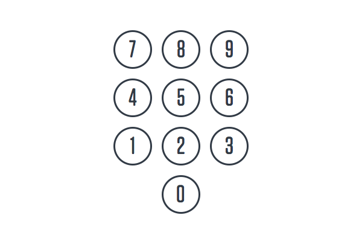

# Bommen Spel

In deze oefening ga je een leuk spel maken om samen met je vrienden te spelen.
Het doel van het spel is om niet te ontploffen, als je wel ontploft, dan ben je af.

## Spel uitleg

In dit spel hebben we een bom die we niet moeten laten ontploffen. 
Het is de bedoeling dat de spelers omstebeurt op een toets van het keypad drukken.

(keypad)

Wanneer een speler de toets indrukt, zal de bom ontploffen of niet.
Als de bom wel ontploft, heb je verloren en is het spel afgelopen.
Als de bom niet ontploft, mag je verder spelen totdat de bom wel ontploft.

## Randvoorwaarden

Het spel bevat:
- 1 Scanner
- 1 Random
- 2 int (bomb en input)
- 1 for-loop OF 1 while-loop 
- 1 if/else-statement OF 1 switch-statement

## Programmeer stappen

- Als eerst clonen we dit project, zodat we de `src` map, de `Main` class en de `Util` class hebben.
- In de Main class maken we een `main` method (hiervoor kunnen we het livetemplate `psvm` gebruiken).
- Vervolgens moeten we een manier maken om de input van de gebruiken in te lezen. 
 Hiervoor maken we een nieuw `Scanner` object met als argument `System.in`.
- We maken ook een nieuw `Random` object, net zoals we dat met Scanner hebben gedaan. 
 Dit object heeft geen argument nodig.
- Vervolgens maken we een `int bomb` die als waarde (=) een random int heeft 
 (gebruik hiervoor de `nextInt(9)` methode met als argument 9, omdat we 9 nummers op ons keypad hebben). Dit wordt de random toegewezen locatie van de toets die de bom laat ontploffen.
- We maken ook een `int input` die we als waarde `-1` geven.
- Nu maken we een for-loop OF een while-loop (Slechts één keuze is goed). 
 De loop blijft loopen zolang `input != bomb`.
- In de loop printen we als eerst de String `"\nKies een nummer van het keypad om in te drukken"` 
 (`"\n"` betekend "new line")
- Daarna schrijven we een nieuwe waarde toe aan input met `input = scanner.nextInt()`
- Als laatste maken we een if/else-statement OF een switch-statement. (Slechts één keuze is goed)
  - Als `input == bomb`, dan roepen we `Util.printExplosion()` aan,
  - Als `input != bomb`, dan roepen we `Util.printBomb()` aan.

## Bonus
In plaats van een keypad met nummer 0 t/m 9, hebben we nu een keypad met 9 kleuren.

(kleuren keypad)

Probeer het spel aan te passen, zodat het kleuren accepteerd ipv nummers
hints: 
- gebruik `scanner.nextLine()` om String waardes van de gebruiker te vragen.
- maak een String array met de waardes `{"groen", "oker", "blauw", "rood", "paars", "aqua", "wit", "geel", "roze"}`
- gebruik voor je loop `input != colors[bomb-1]` om te bepalen of je nog moet blijven loopen of niet.

## Antwoorden
De antwoorden staan in de "answers" branch.
De bonus antwoorden staan in de "bonus" branch.
Weet je niet meer hoe je van branch wisselt? Kijk dan nog eens op pagina 8 van de leerlijnhandleiding.